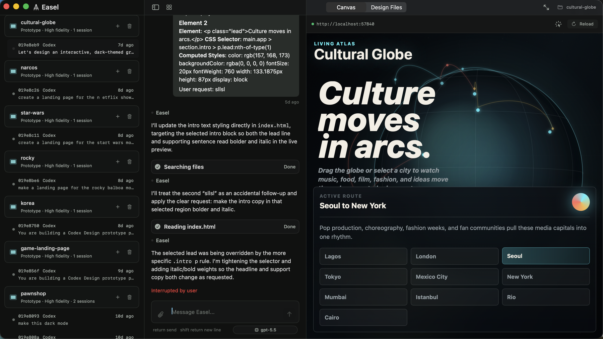

# Easel

[](LICENSE)

Easel is a macOS workspace for AI-assisted product design and frontend iteration. It combines a local project library, design-system setup, Claude/Codex chat surfaces, live web previews, web inspection, and slide preview tooling in one SwiftUI app.

## Examples




## Requirements

- macOS 26.2 or newer
- Xcode 26.4 or newer
- Claude Code CLI installed and authenticated
- GitHub CLI is optional, but useful for contributor workflows

## Build

Clone the repository and open `Easel.xcodeproj` in Xcode, then build the shared `Easel` scheme.

Command-line build:

```sh
xcodebuild \
  -project Easel.xcodeproj \
  -scheme Easel \
  -destination 'platform=macOS' \
  -skipPackagePluginValidation \
  build
```

Run the package tests with Xcode so CodeEdit package dependencies resolve correctly:

```sh
cd Packages/EaselChat
xcodebuild \
  -scheme EaselChat-Package \
  -destination 'platform=macOS' \
  -skipPackagePluginValidation \
  test
```

## Architecture

- `Easel/` contains the macOS app target, app delegate, status item, window controllers, and canvas shell.
- `Packages/EaselKit/` contains shared app state, domain models, and protocol interfaces.
- `Packages/EaselChat/` contains the chat panel, project/design-system managers, design library, and resource browser.
- `Packages/EaselClaudeCodeUI/` contains reusable Claude/Codex chat UI, storage, runtime, and permission-service integration.
- `Packages/EaselServerManager/` manages local development server processes and URL detection.
- `Packages/EaselWebInspector/` contains the embedded web preview inspector.
- `Packages/EaselPreview/` contains the preview panel shell.
- `Packages/EaselSlides/` contains slide-deck scaffolding and preview support.

## Installation And Updates

Signed releases are distributed from GitHub Releases. Sparkle is integrated for automatic updates using EdDSA signature verification and the root `appcast.xml` feed.

Release automation expects these GitHub secrets:

- `CERTIFICATE_BASE64`
- `CERTIFICATE_PASSWORD`
- `KEYCHAIN_PASSWORD`
- `TEAM_ID`
- `APPLE_ID`
- `APP_PASSWORD`
- `SPARKLE_PRIVATE_KEY`

## License

Easel is available under the MIT license. See [LICENSE](LICENSE).
